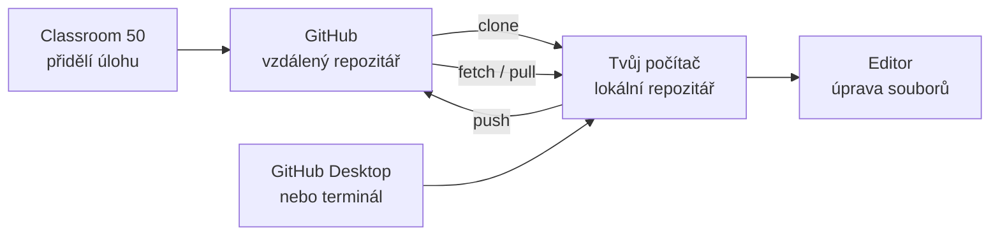
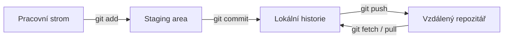

# Git od úplných základů

Praktický průvodce verzováním, GitHubem, GitHub Desktopem, terminálem a Classroom 50

**Autor:** Mgr. Libor Čamek  
**Určeno pro:** žáky, kteří s Gitem dosud nepracovali  
**Aktualizováno:** 3. 9. 2026

---

## Co se v tomto materiálu naučíš

Po projití materiálu dokážeš:

- vysvětlit, proč se používá systém správy verzí;
- rozlišit Git, GitHub, GitHub Desktop a Classroom 50;
- získat školní repozitář do počítače;
- poznat pracovní složku, staging area, commit a vzdálený repozitář;
- ukládat práci pomocí commitů;
- odesílat práci na GitHub a stahovat změny spolupracovníků;
- vytvářet větve a bezpečně je slučovat;
- vyřešit jednoduchý konflikt;
- napravit běžné chyby bez ztráty práce;
- pracovat v GitHub Desktopu i v terminálu;
- odevzdat práci v repozitáři vytvořeném přes Classroom 50.

> Neuč se příkazy nazpaměť bez pochopení. Nejdůležitější je vědět, **kde se změna právě nachází**, co se má stát v dalším kroku a zda pracuješ pouze lokálně, nebo už měníš sdílený repozitář.

## Obsah

1. [Proč vůbec verzovat](#1-proč-vůbec-verzovat)
2. [Git, GitHub, GitHub Desktop a Classroom 50](#2-git-github-github-desktop-a-classroom-50)
3. [Jak Git přemýšlí o projektu](#3-jak-git-přemýšlí-o-projektu)
4. [Instalace a první nastavení](#4-instalace-a-první-nastavení)
5. [Jak získat školní repozitář](#5-jak-získat-školní-repozitář)
6. [README a Markdown](#6-readme-a-markdown)
7. [Každodenní práce v terminálu](#7-každodenní-práce-v-terminálu)
8. [Každodenní práce v GitHub Desktopu](#8-každodenní-práce-v-github-desktopu)
9. [Větve](#9-větve)
10. [Merge a pull request](#10-merge-a-pull-request)
11. [Fetch, pull a push](#11-fetch-pull-a-push)
12. [Konflikty](#12-konflikty)
13. [Jak vracet změny](#13-jak-vracet-změny)
14. [.gitignore a soubory, které do repozitáře nepatří](#14-gitignore-a-soubory-které-do-repozitáře-nepatří)
15. [Bezpečnost a dobrá týmová praxe](#15-bezpečnost-a-dobrá-týmová-praxe)
16. [Classroom 50 krok za krokem](#16-classroom-50-krok-za-krokem)
17. [Praktické úlohy](#17-praktické-úlohy)
18. [Learn Git Branching](#18-learn-git-branching)
19. [Tahák příkazů](#19-tahák-příkazů)
20. [Řešení typických problémů](#20-řešení-typických-problémů)
21. [Slovníček](#21-slovníček)
22. [Závěrečné ověření](#22-závěrečné-ověření)

---

## 1. Proč vůbec verzovat

Představ si, že vytváříš web nebo program. Postupně vzniknou soubory:

```text
projekt-final.zip
projekt-final-opraveny.zip
projekt-final-opraveny2.zip
projekt-opravdu-final.zip
projekt-opravdu-final-posledni.zip
```

Tento způsob má několik problémů:

- není jasné, která verze je správná;
- není vidět, co se mezi verzemi změnilo;
- nevíme, proč změna vznikla;
- při týmové práci si lidé přepisují soubory;
- návrat k funkčnímu stavu je obtížný;
- kopie celého projektu zabírají místo;
- omylem lze odevzdat jinou složku než tu, ve které se skutečně pracovalo.

**Systém správy verzí** zaznamenává historii změn. Umožňuje zjistit:

- kdo změnu vytvořil;
- kdy ji vytvořil;
- které soubory a řádky změnil;
- proč změnu provedl;
- na jakou předchozí verzi změna navazuje;
- zda je možné změnu bezpečně spojit s prací ostatních.

Git je **distribuovaný systém správy verzí**. Každý běžný klon repozitáře obsahuje nejen aktuální soubory, ale také historii projektu. Základní lokální práci proto lze provádět i bez připojení k internetu.

### Co Git není

Git není:

- automatická cloudová záloha všech souborů v počítači;
- náhrada za promyšlené zálohování;
- služba pro sdílení souborů jako síťový disk;
- pouze web GitHub;
- pouze tlačítko „uložit“;
- kouzelný nástroj, který vždy sám pozná správné řešení konfliktu.

Git sleduje jen soubory uvnitř konkrétního repozitáře a pouze změny, které do historie vědomě uložíš commitem.

---

## 2. Git, GitHub, GitHub Desktop a Classroom 50

Tyto názvy označují různé části pracovního prostředí.

| Nástroj | Co to je | K čemu slouží | Funguje bez internetu? |
|---|---|---|---|
| **Git** | program a systém správy verzí | historie, commity, větve, slučování | pro lokální práci ano |
| **GitHub** | internetová služba pro Git repozitáře | sdílení, účty, pull requesty, kontrola kódu | ne |
| **GitHub Desktop** | grafická desktopová aplikace | pohodlné ovládání Gitu a GitHubu | lokální operace ano |
| **Classroom 50** | školní vrstva nad GitHubem | přidělování úloh a vytváření žákovských repozitářů | ne |
| **editor / IDE** | program pro úpravu souborů | psaní kódu a textu | většinou ano |
| **terminál** | textové rozhraní operačního systému | spouštění příkazů včetně `git` | ano, kromě síťových operací |

### Jednoduché přirovnání

- **Git** je systém evidence historie.
- **GitHub** je místo, kde lze Git repozitář sdílet.
- **GitHub Desktop** je grafický ovládací panel.
- **Classroom 50** rozdává školní zadání a propojuje je s GitHub repozitáři.
- **Visual Studio Code, PyCharm nebo jiný editor** je pracovní stůl, na kterém upravuješ soubory.

### Kde je moje práce?

Stejný projekt může existovat na více místech:



Soubor změněný v editoru se **automaticky neobjeví na GitHubu**. Musíš vytvořit commit a poté provést push.

---

## 3. Jak Git přemýšlí o projektu

### 3.1 Repozitář

**Repozitář** je projekt spravovaný Gitem. V pracovní složce obsahuje skrytý adresář `.git`, ve kterém Git uchovává databázi objektů, reference a konfiguraci.

```text
moje-aplikace/
├── .git/          ← interní data Gitu; ručně neupravovat
├── README.md
├── src/
└── tests/
```

Pokud `.git` smažeš, běžné soubory zůstanou, ale složka přestane být Git repozitářem a ztratí lokální historii a nastavení remote.

### 3.2 Čtyři místa, mezi kterými změna putuje

Začátečník potřebuje rozlišovat čtyři stavy:

1. **pracovní strom** – soubory, které právě vidíš a upravuješ;
2. **staging area neboli index** – přesný návrh obsahu příštího commitu;
3. **lokální repozitář** – commity uložené v `.git` ve tvém počítači;
4. **vzdálený repozitář** – sdílený repozitář, obvykle na GitHubu.



To vysvětluje, proč nestačí soubor pouze uložit:

- **uložit v editoru** znamená změnit pracovní strom;
- **stage/add** znamená vybrat změnu do příštího commitu;
- **commit** znamená uložit snímek do lokální historie;
- **push** znamená odeslat nové commity do vzdáleného repozitáře.

### 3.3 Stav souboru

Soubor může být:

- **untracked** – Git o něm ví, ale ještě ho nezařadil do historie;
- **unmodified** – odpovídá poslednímu commitu;
- **modified** – změnil se v pracovním stromu;
- **staged** – jeho aktuální podoba je připravena do příštího commitu;
- **committed** – jeho snímek je uložen v lokální historii.

Jeden soubor může mít současně staged i další unstaged změny. Do commitu se pak uloží pouze podoba, kterou jsi vložil/a do staging area.

### 3.4 Commit

**Commit** je neměnný bod historie. Obsahuje zejména:

- odkaz na snímek projektu;
- odkaz na předchozí commit nebo commity;
- jméno a e-mail autora;
- čas;
- zprávu popisující význam změny.

Commit má identifikátor nazývaný **hash**, například:

```text
7e4a91f Oprav kontrolu prázdného hesla
```

Zápis `7e4a91f` je zkrácený začátek skutečného hashe. Hash se používá jako přesný odkaz na commit.

### 3.5 Git ukládá snímky a vztahy

Pro základní práci si commit představuj jako snímek projektu. Git interně ukládá obsah efektivně: stejné objekty zbytečně neduplikuje. Commit zároveň ukazuje na svého rodiče, takže vzniká orientovaný graf historie.

```text
A ← B ← C ← D
```

Commit `D` navazuje na `C`, ten na `B` a ten na `A`. Větev obvykle ukazuje na poslední commit své vývojové linie.

### 3.6 Větev

**Větev** není kopie celé složky. Je to pohyblivý odkaz na commit.

```text
              D ← E  feature
             /
A ← B ← C ← F        main
```

Větve umožňují vyvíjet funkci, opravovat chybu nebo experimentovat odděleně od hlavní linie `main`.

### 3.7 HEAD

`HEAD` označuje místo, na kterém právě pracuješ. Obvykle ukazuje na aktuální větev:

```text
HEAD → main → poslední commit
```

Když vytvoříš nový commit, posune se aktuální větev a `HEAD` zůstane připojen k ní.

### 3.8 Lokální a vzdálená historie

Lokální větev `main` a remote-tracking reference `origin/main` nejsou totéž:

- `main` je tvoje lokální pracovní větev;
- `origin` je obvyklý název vzdáleného repozitáře;
- `origin/main` je lokální záznam o tom, kde byla vzdálená větev `main` při poslední komunikaci.

`origin/main` není živý pohled na internet. Aktualizuje se při `fetch`, `pull` nebo úspěšném `push`.

---

## 4. Instalace a první nastavení

### 4.1 Potřebné účty a programy

Pro školní práci s Classroom 50 obvykle potřebuješ:

1. účet na GitHubu;
2. přístup do školní GitHub organizace;
3. Git;
4. GitHub Desktop nebo terminál;
5. editor či IDE;
6. webový prohlížeč pro Classroom 50 a GitHub.

Nikomu neposílej heslo, obnovovací kódy ani přístupový token.

### 4.2 Instalace Gitu

Aktuální instalační balíčky jsou na <https://git-scm.com/install/>.

#### Windows

Možnosti:

- stáhnout **Git for Windows** z oficiálního webu;
- nebo použít PowerShell:

```powershell
winget install --id Git.Git -e --source winget
```

Instalace obvykle přidá Git Bash a příkaz `git` do systému. Pro první výuku lze většinu instalačních voleb ponechat ve výchozím stavu.

#### macOS

Příkaz `git --version` může nabídnout instalaci Command Line Tools. Další možností je instalační balíček nebo správce balíčků Homebrew:

```bash
brew install git
```

#### Linux

Použij správce balíčků své distribuce, například:

```bash
sudo apt update
sudo apt install git
```

### 4.3 Kontrola instalace

Otevři terminál a spusť:

```bash
git --version
```

Správný výsledek obsahuje číslo verze, například `git version 2.x.x`. Konkrétní číslo se může lišit.

### 4.4 Identita autora

Git zapisuje ke commitu jméno a e-mail. Nastav je tak, aby odpovídaly školnímu GitHub účtu:

```bash
git config --global user.name "Jana Novakova"
git config --global user.email "jana@example.cz"
```

Kontrola:

```bash
git config --global --list
```

`--global` nastavuje výchozí hodnotu pro repozitáře daného uživatele. V jednom repozitáři lze hodnotu změnit bez `--global`.

### 4.5 Výchozí název větve

```bash
git config --global init.defaultBranch main
```

Nově vytvořené repozitáře pak budou standardně používat větev `main`.

### 4.6 Konce řádků

Windows historicky používá CRLF, Linux a macOS LF. Nesprávné nastavení může způsobit, že Git ukazuje změnu na každém řádku. Pro běžnou práci se řiď nastavením školy a souborem `.gitattributes`, pokud jej repozitář obsahuje. Neměň konce řádků hromadně bez důvodu.

### 4.7 Instalace GitHub Desktopu

GitHub Desktop stáhni z <https://desktop.github.com/>. Po instalaci:

1. přihlas se ke správnému GitHub účtu;
2. zkontroluj jméno a e-mail pro commity;
3. nastav preferovaný editor;
4. zkontroluj výchozí umístění klonovaných repozitářů.

GitHub Desktop neodstraňuje potřebu Git pochopit. Pouze stejné operace zpřístupňuje graficky.

### 4.8 HTTPS a SSH

GitHub pro síťové operace podporuje zejména HTTPS a SSH.

- **HTTPS** je pro začátek jednodušší; přihlášení obvykle zprostředkuje správce přihlašovacích údajů nebo GitHub Desktop.
- **SSH** používá pár klíčů. Soukromý klíč zůstává v počítači, veřejný klíč se přidá do GitHub účtu.

Běžné heslo účtu se nepoužívá jako heslo pro Git přes HTTPS. Pokud škola neurčí jinak, začni přes GitHub Desktop nebo HTTPS přihlášení v prohlížeči.

---

## 5. Jak získat školní repozitář

Nejdřív přijmi konkrétní úlohu v Classroom 50. Služba vytvoří nebo zpřístupní repozitář v GitHub organizaci školy. Teprve tento repozitář klonuj.

### 5.1 Clone není stažení ZIPu

**Clone** vytvoří pracovní kopii i s Git historií a nastaví propojení na vzdálený repozitář. ZIP obsahuje jen soubory a není vhodným začátkem běžné Git práce.

### 5.2 Klonování v GitHub Desktopu

1. Na stránce repozitáře na GitHubu klikni na **Code**.
2. Zvol **Open with GitHub Desktop**.
3. Vyber lokální umístění.
4. Klikni na **Clone**.
5. V GitHub Desktopu zkontroluj název aktuálního repozitáře a větev `main`.
6. Tlačítkem **Open in Visual Studio Code** nebo **Show in Finder/Explorer** otevři právě tento klon.

### 5.3 Klonování v terminálu

Na GitHubu zkopíruj HTTPS adresu repozitáře a spusť:

```bash
git clone https://github.com/ORGANIZACE/REPOZITAR.git
cd REPOZITAR
git status
git remote -v
```

`git remote -v` má ukázat adresu pro fetch a push pod názvem `origin`.

### 5.4 Jak poznat, že pracuješ ve správné složce

V terminálu:

```bash
git rev-parse --show-toplevel
git status
git remote -v
```

Zkontroluj:

- cestu ke kořeni repozitáře;
- název aktuální větve;
- URL remote;
- že upravovaný soubor leží uvnitř této složky.

Častá školní chyba: žák naklonuje repozitář, ale v editoru upravuje původní kopii nebo ZIP v jiné složce. GitHub Desktop pak žádné změny neukazuje.

---

## 6. README a Markdown

Soubor `README.md` je úvodní dokument repozitáře. GitHub jej automaticky zobrazí na hlavní stránce projektu.

README by měl vysvětlovat:

- co projekt dělá;
- jak jej spustit;
- jaké má požadavky;
- jak vypadá očekávaný vstup a výstup;
- kdo jej vytvořil;
- případně jak projekt testovat a odevzdat.

### 6.1 Základní Markdown

````markdown
# Hlavní nadpis

## Podnadpis

Běžný text s **tučným písmem** a `kódem`.

- první bod
- druhý bod

1. první krok
2. druhý krok

[Odkaz](https://example.com)

```python
print("Ahoj")
```
````

### 6.2 Dobrá praxe pro README

- Název souboru piš přesně `README.md`.
- Za nadpisem nech prázdný řádek.
- Příkazy dávej do kódových bloků.
- Neuváděj hesla, tokeny ani osobní údaje.
- Odkazy popiš smysluplným názvem.
- Před odevzdáním zkontroluj náhled na GitHubu.

---

## 7. Každodenní práce v terminálu

### 7.1 Nejbezpečnější základní cyklus

```bash
git status
git pull --ff-only

# uprav soubory v editoru

git status
git diff
git add cesta/k/souboru
git diff --staged
git commit -m "Strucne popis vyznamu zmeny"
git push
```

Jednotlivé kroky mají rozdílný význam.

### 7.2 `git status`

```bash
git status
```

Ukazuje:

- aktuální větev;
- vztah k upstream větvi;
- staged změny;
- unstaged změny;
- nesledované soubory;
- probíhající merge nebo rebase.

Používej jej často. Je pouze informační a nic nemaže.

### 7.3 `git diff`

```bash
git diff
```

Ukáže unstaged změny proti staging area.

```bash
git diff --staged
```

Ukáže přesný obsah připravený do příštího commitu. Tento příkaz je nejlepší kontrola před commitem.

Základ značek v diffu:

```diff
- původní řádek
+ nový řádek
```

Červené mínus neznamená automaticky chybu; označuje odstraněný řádek. Zelené plus označuje přidaný řádek.

### 7.4 `git add`

```bash
git add README.md
git add src/app.py tests/test_app.py
```

`git add` vloží aktuální podobu vybraných změn do staging area. Příkaz neodesílá data na GitHub a ještě nevytváří commit.

Pro přesnou práci lze použít:

```bash
git add -p
```

Interaktivně vybereš jednotlivé části změn.

`git add .` je pohodlný, ale může přidat logy, sestavené soubory nebo tajemství. Vždy potom zkontroluj `git status` a `git diff --staged`.

### 7.5 `git commit`

```bash
git commit -m "Pridej kontrolu prazdneho vstupu"
```

Commit uloží staged obsah do lokální historie. Dobrá zpráva commitu:

- je krátká a konkrétní;
- popisuje význam změny;
- nepoužívá nicneříkající text „update“, „oprava“ nebo „hotovo“;
- nepopisuje pouze název souboru.

Příklady:

```text
Špatně:  update
Špatně:  README
Lépe:    Doplň návod ke spuštění projektu
Lépe:    Ošetři dělení nulou ve výpočtu průměru
```

### 7.6 `git log`

```bash
git log --oneline --graph --decorate --all
```

Zobrazí stručný graf historie, hashe, větve a tagy. Ukončení dlouhého výpisu v terminálu se často provádí klávesou `q`.

### 7.7 `git push`

```bash
git push
```

Push odešle nové lokální commity na nastavený remote. Neodesílá necommitované změny.

První publikování nové větve:

```bash
git push -u origin nazev-vetve
```

Parametr `-u` nastaví upstream, aby příště stačilo `git push` a `git pull`.

### 7.8 Kdy je práce skutečně odevzdaná

Práce není bezpečně odevzdaná pouze proto, že:

- je soubor uložen v editoru;
- GitHub Desktop ukazuje změnu;
- existuje lokální commit;
- terminál píše „working tree clean“.

Pro odevzdání musí být správné commity po pushi viditelné ve správném repozitáři a větvi na GitHubu.

U Classroom 50 může být rozdíl mezi **uložením práce** a **odesláním ke klasifikaci**. Push vždy uloží commity do přiděleného repozitáře, ale některé úlohy se hodnotí až po samostatném submit kroku nebo po odeslání předepsaného tagu. Vždy zkontroluj pokyny konkrétní úlohy a stav **My submission**.

---

## 8. Každodenní práce v GitHub Desktopu

GitHub Desktop ovládá stejný repozitář jako terminál. Změny vytvořené jedním způsobem okamžitě vidí i druhý způsob.

### 8.1 Orientace v okně

Kontroluj zejména:

- **Current Repository** – ve kterém projektu pracuješ;
- **Current Branch** – na které větvi pracuješ;
- **Changes** – změněné soubory a řádky;
- **History** – seznam commitů;
- **Summary** – zpráva nového commitu;
- **Fetch origin / Pull origin / Push origin** – síťové operace.

### 8.2 Základní cyklus

1. Vyber správný repozitář.
2. Vyber správnou větev.
3. Klikni na **Fetch origin** a případně **Pull origin**.
4. Uprav soubory v editoru a ulož je.
5. V kartě **Changes** zkontroluj diff.
6. Zaškrtni pouze soubory, které patří do jednoho commitu.
7. Do **Summary** napiš konkrétní zprávu.
8. Klikni na **Commit to ...**.
9. Klikni na **Push origin**.
10. Ověř výsledek pomocí **View on GitHub**.

### 8.3 Desktop a terminál vedle sebe

| GitHub Desktop | Terminál | Význam |
|---|---|---|
| Changes | `git status`, `git diff` | prohlédnutí změn |
| zaškrtnutí souboru | `git add soubor` | výběr do commitu |
| Commit to ... | `git commit` | vytvoření lokálního commitu |
| History | `git log` | historie |
| New Branch | `git switch -c` | vytvoření větve |
| Switch Branch | `git switch` | přepnutí větve |
| Fetch origin | `git fetch origin` | stažení informací bez sloučení |
| Pull origin | `git pull` | stažení a začlenění |
| Push origin | `git push` | odeslání commitů |
| Revert Changes in Commit | `git revert` | nový opravný commit |

### 8.4 Když Desktop změny neukazuje

Nejčastější příčiny:

- upravuješ soubor v jiné kopii projektu;
- soubor nebyl uložen;
- je ignorován pomocí `.gitignore`;
- v Desktopu je vybraný jiný repozitář;
- soubor leží mimo kořen repozitáře;
- prohlížíš historii místo změn.

Použij **Repository → Show in Explorer/Finder** a porovnej otevřenou cestu s cestou v editoru.

---

## 9. Větve

### 9.1 Proč větev používat

Větev oddělí rozpracovanou změnu od stabilní větve `main`. Hodí se pro:

- novou funkci;
- opravu chyby;
- experiment;
- samostatnou část týmové práce;
- školní úkol, pokud to vyžaduje zadání.

### 9.2 Název větve

Používej stručný významový název bez mezer:

```text
feature/prihlaseni
fix/deleni-nulou
docs/navod-instalace
```

### 9.3 Vytvoření v terminálu

Nejprve se vrať na aktuální `main`:

```bash
git switch main
git pull --ff-only
git switch -c feature/prihlaseni
```

Starší návody mohou používat:

```bash
git checkout -b feature/prihlaseni
```

### 9.4 Vytvoření v GitHub Desktopu

1. Přepni se na `main`.
2. Stáhni aktuální změny.
3. Otevři **Current Branch**.
4. Klikni na **New Branch**.
5. Zadej název a vytvoř větev.
6. Po prvním commitu klikni na **Publish branch**.

### 9.5 Přepínání větví

```bash
git switch main
git switch feature/prihlaseni
```

Při přepnutí se pracovní soubory změní tak, aby odpovídaly vybrané větvi. Git přepnutí odmítne, pokud by přepsalo neuloženou práci.

Neřeš varování automaticky silovým přepnutím. Nejdřív:

```bash
git status
git diff
```

Potom změny commitni, vědomě odlož pomocí stash, nebo je po kontrole zahoď.

### 9.6 Smazání větve

Sloučenou lokální větev lze bezpečně odstranit:

```bash
git branch -d feature/prihlaseni
```

Vzdálenou větev:

```bash
git push origin --delete feature/prihlaseni
```

Smazání větve nemaže automaticky změny, které už jsou dosažitelné z `main`.

---

## 10. Merge a pull request

### 10.1 Merge

**Merge** začlení historii jiné větve do aktuální větve.

```bash
git switch main
git merge feature/prihlaseni
```

Čti příkaz takto:

> Do aktuální větve `main` začleň větev `feature/prihlaseni`.

Směr je důležitý. Nejprve se přepínáš na cílovou větev.

### 10.2 Fast-forward

Pokud se `main` od vytvoření feature větve neposunul, může Git pouze posunout ukazatel `main` dopředu. To je **fast-forward**.

```text
Před:  A ← B  main
             ↖ C ← D  feature

Po:    A ← B ← C ← D  main, feature
```

### 10.3 Merge commit

Pokud se obě větve vyvíjely samostatně, merge může vytvořit commit se dvěma rodiči:

```text
      C ← D  feature
     /     \
A ← B ← E ← M  main
```

Merge commit zachovává informaci, že se dvě linie vývoje spojily.

### 10.4 Pull request

**Pull request** není příkaz `git pull`. Je to návrh na začlenění změn na GitHubu. Umožňuje:

- zobrazit všechny změny;
- vést diskusi;
- spustit automatické testy;
- provést kontrolu kódu;
- změnu schválit a sloučit.

Běžný postup:

```bash
git switch -c feature/prihlaseni
# úpravy, add, commit
git push -u origin feature/prihlaseni
```

Potom na GitHubu vytvoř pull request z `feature/prihlaseni` do `main`.

### 10.5 Rebase – až po zvládnutí základu

Rebase znovu vytvoří vlastní commity nad jiným základem. Výsledkem může být lineární historie, ale commity dostanou nové hashe.

```bash
git switch feature/prihlaseni
git fetch origin
git rebase origin/main
```

Rebase používej pouze tehdy, když rozumíš dopadu a pravidlům projektu. Nepřepisuj bez dohody historii, na které už pracují ostatní.

---

## 11. Fetch, pull a push

### 11.1 Remote

Remote je pojmenované umístění jiného repozitáře.

```bash
git remote -v
```

Po klonování se hlavní remote obvykle jmenuje `origin`.

### 11.2 Fetch

```bash
git fetch origin
```

Fetch:

- stáhne chybějící objekty;
- aktualizuje remote-tracking reference;
- nezmění aktuální pracovní větev;
- nezmění rozpracované soubory.

Je proto vhodný jako bezpečný první krok před kontrolou novinek.

### 11.3 Pull

```bash
git pull
```

Pull provede fetch a následně začlení změny do aktuální větve. Přesné chování závisí na konfiguraci.

Pro začátek je předvídatelný:

```bash
git pull --ff-only
```

Příkaz uspěje pouze tehdy, když lze větev posunout bez vytváření merge commitu. Pokud se historie rozešla, zastaví se a vyžaduje vědomé rozhodnutí.

### 11.4 Push

```bash
git push
```

Push posílá lokální commity a žádá server o posun vzdálené větve.

Push může být odmítnut, když:

- remote obsahuje nové commity;
- nemáš oprávnění;
- větev je chráněná;
- automatické pravidlo zakazuje změnu;
- používáš nesprávný účet nebo remote;
- síťové přihlášení selhalo.

### 11.5 Ahead, behind a diverged

- **ahead** – lokálně máš commity, které remote nemá;
- **behind** – remote má commity, které lokálně nemáš;
- **diverged** – obě strany mají vlastní nové commity.

```text
ahead:       remote A ← B, local A ← B ← C
behind:      local  A ← B, remote A ← B ← C
diverged:           A ← B ← C  local
                         ↖ D    remote
```

Při divergence nezkoušej náhodné příkazy. Nejprve:

```bash
git status
git fetch origin
git log --oneline --graph --decorate --all
```

Potom podle pravidel projektu zvol merge nebo rebase.

### 11.6 Proč nepoužívat `push --force` jako opravu

Silový push může vzdálenou větev posunout zpět a odpojit commity ostatních. Na sdílené nebo školní hlavní větvi jej nepoužívej. Pokud je přepis vlastní feature větve výslovně povolen, bezpečnější varianta je:

```bash
git push --force-with-lease
```

Ani ta není vhodná bez pochopení situace.

---

## 12. Konflikty

### 12.1 Co konflikt znamená

Konflikt vznikne, když Git nedokáže automaticky rozhodnout, jak spojit dvě změny. Typicky obě větve změnily stejný řádek od společného předka.

Konflikt není ztráta projektu. Git se zastavil a čeká na rozhodnutí člověka.

### 12.2 Značky konfliktu

```text
<<<<<<< HEAD
verze z aktuální větve
=======
verze z připojované větve
>>>>>>> feature/prihlaseni
```

Značky nejsou součástí správného výsledku. Musíš:

1. pochopit obě varianty;
2. vytvořit správnou výslednou podobu;
3. odstranit všechny konfliktní značky;
4. soubor uložit;
5. spustit testy;
6. označit konflikt jako vyřešený.

### 12.3 Řešení v terminálu

```bash
git status
# uprav konfliktní soubory
git add cesta/k/vyresenemu-souboru
git status
git commit
```

Zrušení probíhajícího merge:

```bash
git merge --abort
```

### 12.4 Řešení v GitHub Desktopu

1. Otevři seznam konfliktních souborů.
2. Otevři každý soubor v editoru.
3. Vyber nebo ručně vytvoř správný výsledný obsah.
4. Odstraň konfliktní značky.
5. Ulož soubor a spusť projekt nebo testy.
6. V Desktopu potvrď vyřešení.
7. Dokonči merge commit.
8. Proveď push.

### 12.5 Jak konfliktům předcházet

- před začátkem práce aktualizuj `main`;
- vytvářej krátce žijící větve;
- commituj malé logické změny;
- nerozděluj jeden soubor mezi více lidí bez domluvy;
- nepřidávej do jednoho commitu automatické přeformátování celého projektu a funkční změnu;
- komunikuj o změnách názvů a přesunech souborů.

---

## 13. Jak vracet změny

Nejdřív urči, kde chyba je. Jiný postup se používá pro neuložený soubor, staged změnu, lokální commit a publikovaný commit.

### 13.1 Rozhodovací tabulka

| Situace | Doporučený nástroj | Co zachová |
|---|---|---|
| nechci necommitovanou změnu souboru | `git restore soubor` | ostatní změny |
| soubor nemá být staged | `git restore --staged soubor` | změnu v pracovním stromu |
| poslední lokální commit má špatnou zprávu | `git commit --amend` | obsah, ale vytvoří nový hash |
| publikovaný commit je chybný | `git revert hash` | historii, přidá opravný commit |
| potřebuji najít dřívější lokální stav | `git reflog` | záznam pohybu referencí |
| chci vědomě zahodit vše necommitované | `git reset --hard` | nic necommitovaného; nebezpečné |

### 13.2 Obnovení necommitované změny

```bash
git diff
git restore README.md
```

Po `restore` nebude běžná necommitovaná změna snadno obnovitelná. Nejdřív diff skutečně přečti.

### 13.3 Odebrání ze staging area

```bash
git restore --staged README.md
```

Soubor zůstane upravený, ale nebude součástí příštího commitu.

### 13.4 Oprava posledního lokálního commitu

```bash
git commit --amend -m "Spravna zprava commitu"
```

Amend nahradí poslední commit novým. Používej jej hlavně před publikováním.

### 13.5 Revert publikované změny

```bash
git revert 7e4a91f
```

Revert vytvoří nový commit s opačnou změnou. Původní historie zůstává viditelná, proto je to běžná bezpečná volba pro sdílenou větev.

### 13.6 Reset

`git reset` přesouvá aktuální větev. Režimy mají velmi odlišné následky:

| Režim | Commit | Staging area | Pracovní soubory |
|---|---|---|---|
| `--soft` | větev se přesune | zachová | zachová |
| `--mixed` | větev se přesune | zruší staging | zachová |
| `--hard` | větev se přesune | přepíše | přepíše |

Před resetem vždy:

```bash
git status
git diff
git diff --staged
git log --oneline --graph --decorate --all
```

### 13.7 Reflog jako záchranná stopa

```bash
git reflog
```

Reflog ukazuje, kam lokální reference v minulosti ukazovaly. Pokud chybný reset nebo rebase „ztratí“ commit, můžeš na nalezeném hashi vytvořit záchrannou větev:

```bash
git switch -c zachrana HASH
```

Reflog je lokální a není náhradou dlouhodobé zálohy.

---

## 14. `.gitignore` a soubory, které do repozitáře nepatří

Soubor `.gitignore` říká Gitu, které nesledované soubory nemá nabízet k přidání.

Příklad:

```gitignore
# Python
__pycache__/
*.pyc
.venv/

# Vývojové prostředí
.idea/
.vscode/

# Lokální tajemství
.env

# Sestavené soubory
dist/
build/
```

Pravidla musí odpovídat konkrétnímu projektu. Například `.vscode/` někdy obsahuje užitečnou sdílenou konfiguraci a jindy pouze osobní nastavení.

### Důležitá omezení

- `.gitignore` neodstraní soubor, který už Git sleduje.
- `.gitignore` nevymaže soubor ze starších commitů.
- Přidání tajemství do `.gitignore` po commitu neřeší únik.

Pokud byl commitnut token nebo heslo, považuj jej za prozrazený a okamžitě jej zneplatni nebo změň.

---

## 15. Bezpečnost a dobrá týmová praxe

### 15.1 Nikdy necommituj

- hesla;
- osobní přístupové tokeny;
- soukromé SSH klíče;
- obsah souboru `.env` s tajemstvími;
- databáze s osobními údaji;
- velké binární soubory, pokud projekt nemá určený postup;
- automaticky vytvořené složky závislostí, pokud se běžně obnovují instalací.

### 15.2 Před každým commitem

```bash
git status
git diff --staged
```

Zkontroluj:

- patří všechny soubory k jedné změně?
- není v diffu heslo nebo token?
- nejsou přidány logy, cache nebo sestavené soubory?
- je změna dokončená a otestovaná?
- popisuje zpráva skutečný význam?

### 15.3 Dobré commity

Dobrý commit je:

- malý;
- logicky samostatný;
- spustitelný nebo alespoň konzistentní;
- otestovaný;
- popsaný konkrétní zprávou.

### 15.4 Doporučený týmový rytmus

1. Aktualizuj `main`.
2. Vytvoř vlastní větev.
3. Udělej malou související změnu.
4. Zkontroluj diff a testy.
5. Vytvoř commit.
6. Pravidelně publikuj větev.
7. Vytvoř pull request.
8. Zapracuj připomínky.
9. Po schválení větev sluč.
10. Lokálně znovu aktualizuj `main`.

---

## 16. Classroom 50 krok za krokem

Classroom 50 je nástroj pro správu školních úloh nad GitHubem. Nevytváří jiný druh repozitáře; výsledkem je běžný GitHub repozitář s oprávněními a případnou automatickou kontrolou.

### 16.1 První přihlášení

1. Otevři <https://classroom50.org/>.
2. Přihlas se pomocí správného GitHub účtu.
3. Pokud je to vyžadováno, povol přístup ke školní organizaci.
4. Zkontroluj, že vidíš správnou školu, kurz nebo pozvánku.

Nikdy nezakládej druhý účet jen proto, že úloha není vidět. Nejprve ověř, pod kterým účtem jsi přihlášen/a, a kontaktuj vyučujícího.

### 16.2 Přijetí úlohy

1. Otevři odkaz na konkrétní assignment.
2. Potvrď přijetí.
3. Počkej na vytvoření repozitáře.
4. Otevři vytvořený repozitář na GitHubu.
5. Zkontroluj vlastníka a přesný název repozitáře.
6. Tento repozitář naklonuj.

Pro každého žáka nebo tým může vzniknout samostatný privátní repozitář. Nepracuj v cizím repozitáři ani v původním template repozitáři.

### 16.3 Práce na úloze

```bash
git clone URL_PRIDELENEHO_REPOZITARE
cd NAZEV_REPOZITARE
git status

# práce v editoru

git add KONKRETNI_SOUBORY
git diff --staged
git commit -m "Dokonci prvni cast ulohy"
git push
```

Řiď se zadáním. Některé úlohy vyžadují práci přímo v `main`, jiné očekávají větev nebo pull request.

### 16.4 Kontrola odevzdání

Na stránce GitHub repozitáře ověř:

- správný účet, organizaci a repozitář;
- správnou větev;
- poslední commit a jeho čas;
- přítomnost všech požadovaných souborů;
- vykreslení README;
- výsledek automatických testů nebo Actions, pokud jsou použity.

Potom otevři v Classroom 50 danou úlohu a položku **My submission** nebo **Group submission**. Ta ukazuje, zda Classroom 50 eviduje odevzdání a kdy k němu došlo.

### 16.5 Uložení práce není vždy spuštění klasifikace

U některých úloh každý push rovnou spustí kontrolu. Jiné úlohy hodnotí pouze výslovný submit. Zadání může požadovat například příkaz nástroje `gh student submit` nebo odeslání určeného tagu:

```bash
git tag submit/final
git push origin submit/final
```

Konkrétní název tagu se řídí zadáním. Nevymýšlej jej a neposílej `submit/final`, pokud úloha požaduje jiný milník. Push commitu v takovém případě práci bezpečně uloží, ale nemusí vytvořit hodnocené odevzdání.

Výsledek automatického hodnocení může být dostupný přes **View grade** a GitHub Release s rozpisem testů. Učitel může poskytovat zpětnou vazbu také v pull requestu.

### 16.6 Co se neodevzdá

Na GitHub se neodešlou:

- uložené, ale necommitované změny;
- staged změny bez commitu;
- lokální commit bez push;
- soubory mimo klon repozitáře;
- ignorované soubory;
- změny v jiné větvi, pokud vyučující kontroluje pouze `main`.

---

## 17. Praktické úlohy

Pracuj v novém cvičném adresáři. Nepoužívej důležitý projekt.

### Úroveň 0 – orientace

1. Ověř `git --version`.
2. Zobraz globální konfiguraci.
3. Vytvoř složku `git-cviceni`.
4. Inicializuj repozitář s větví `main`.

```bash
mkdir git-cviceni
cd git-cviceni
git init -b main
git status
```

**Úspěch:** Git vypíše větev `main` a prázdný repozitář bez commitů.

### Úroveň 1 – první commit

1. Vytvoř `README.md`.
2. Napiš název projektu a jednu větu.
3. Zkontroluj stav a diff.
4. Přidej soubor do staging area.
5. Zkontroluj staged diff.
6. Vytvoř commit.

**Úspěch:** `git status` hlásí čistý pracovní strom a `git log --oneline` ukazuje jeden commit.

### Úroveň 2 – přesný obsah commitu

1. Vytvoř `poznamky.txt` a `docasne.log`.
2. Do commitu zahrň pouze `poznamky.txt`.
3. Přidej pravidlo do `.gitignore`, které ignoruje `*.log`.
4. Vytvoř druhý commit.

**Úspěch:** log není sledovaný a commit obsahuje pouze zamýšlené soubory.

### Úroveň 3 – větev

1. Vytvoř větev `docs/navod`.
2. Doplň do README kapitolu „Spuštění“.
3. Vytvoř commit.
4. Prohlédni graf všech větví.
5. Vrať se na `main` a sleduj změnu obsahu README.

**Úspěch:** commit je pouze na `docs/navod` a `main` zatím novou kapitolu neobsahuje.

### Úroveň 4 – merge

1. Na `main` začleň větev `docs/navod`.
2. Ověř obsah a graf.
3. Smaž sloučenou lokální větev.

**Úspěch:** `main` obsahuje změnu a žádný commit se neztratil.

### Úroveň 5 – konflikt

1. Vytvoř větev `pokus-a` a změň první řádek README.
2. Změnu commitni.
3. Na `main` změň stejný řádek jinak a commitni.
4. Pokus se větev sloučit.
5. Prohlédni `git status` a konfliktní značky.
6. Vytvoř smysluplný výsledný řádek, spusť kontrolu a merge dokonči.

**Úspěch:** v souboru nezůstaly konfliktní značky a historie obsahuje obě původní změny i merge.

### Úroveň 6 – lokální vzdálený repozitář

Bez internetové služby lze spolupráci simulovat dvěma klony jednoho holého repozitáře. Tuto úroveň dělej pouze v novém cvičném adresáři.

```bash
git init --bare central.git
git clone central.git student-a
git clone central.git student-b
```

V obou klonech nastav soubory, commity a postupně push/pull. Sleduj, kdy je větev ahead, behind a diverged.

### Bonus – obnova

1. Vytvoř nový commit.
2. Poznamenej si jeho hash.
3. Vytvoř záchrannou větev.
4. Vyzkoušej přesun lokální větve pomocí resetu.
5. Pomocí reflogu najdi původní stav a vytvoř na něm větev.

**Úspěch:** vysvětlíš, proč commit po přesunu větve nezmizel okamžitě a jak jej reflog pomohl najít.

<details>
<summary><strong>Kontrolní řešení základního postupu</strong></summary>

```bash
mkdir git-cviceni
cd git-cviceni
git init -b main

# vytvoř README.md
git status
git add README.md
git diff --staged
git commit -m "Zaloz dokumentaci projektu"

# vytvoř poznamky.txt, docasne.log a .gitignore
git add poznamky.txt .gitignore
git diff --staged
git commit -m "Pridej poznamky a ignorovani logu"

git switch -c docs/navod
# uprav README.md
git add README.md
git commit -m "Dopln navod ke spusteni"
git log --oneline --graph --decorate --all

git switch main
git merge docs/navod
git branch -d docs/navod
```

Řešení konfliktu nemá jediný předem daný text. Správnost určuje, zda výsledný soubor dává smysl, neobsahuje konfliktní značky a funguje.

</details>

---

## 18. Learn Git Branching

Po zvládnutí základního modelu si příkazy a graf historie procvič v interaktivní aplikaci:

**<https://learngitbranching.js.org/>**

Aplikace výborně vizualizuje:

- commity a větve;
- `HEAD`;
- merge a rebase;
- relativní reference `^` a `~`;
- reset a revert;
- cherry-pick;
- vzdálené větve, fetch, pull a push.

### Důležité rozdíly proti skutečnému Gitu

- Simulátor vytváří abstraktní commity bez skutečných souborů a staging area.
- Označení `C1`, `C2` a podobně jsou výukové identifikátory, ne běžné skutečné hashe.
- Zkratka `o/main` v simulátoru představuje běžné `origin/main`.
- `git fakeTeamwork` je pouze simulační příkaz.
- `git clone` je v některých lekcích modelován opačně než v reálném použití.
- Aplikace používá často `git checkout`; pro běžné přepínání větví je dnes čitelný také `git switch`.
- Simulace neukazuje všechny souborové konflikty, přístupová práva ani pravidla serveru.

Používej aplikaci jako **laboratoř pro graf historie**, ne jako jediný návod k reálné práci.

---

## 19. Tahák příkazů

### Informace

```bash
git status
git diff
git diff --staged
git log --oneline --graph --decorate --all
git branch -vv
git remote -v
```

### Začátek projektu

```bash
git init -b main
git clone URL
```

### Uložení změny

```bash
git add SOUBOR
git commit -m "Popis zmeny"
git push
```

### Větve

```bash
git switch -c NOVA-VETEV
git switch EXISTUJICI-VETEV
git branch
git branch -d SLOUCENA-VETEV
```

### Synchronizace

```bash
git fetch origin
git pull --ff-only
git push
git push -u origin NOVA-VETEV
```

### Sloučení

```bash
git switch CILOVA-VETEV
git merge ZDROJOVA-VETEV
git merge --abort
```

### Bezpečná oprava

```bash
git restore SOUBOR
git restore --staged SOUBOR
git commit --amend
git revert HASH
git reflog
```

---

## 20. Řešení typických problémů

### `fatal: not a git repository`

**Příčina:** terminál není uvnitř klonovaného nebo inicializovaného repozitáře.

**Kontrola:** zobraz aktuální cestu a obsah složky.

```bash
pwd        # macOS / Linux / Git Bash
Get-Location  # PowerShell
```

**Oprava:** přejdi pomocí `cd` do správné složky. Nespouštěj automaticky `git init` uvnitř náhodné složky.

### Git neukazuje změnu

**Příčina:** soubor není uložen, leží mimo repozitář, je ignorovaný nebo upravuješ jinou kopii.

```bash
git rev-parse --show-toplevel
git status --ignored
```

### Push píše `non-fast-forward`

**Příčina:** vzdálená větev obsahuje commit, který lokální větev neobsahuje.

```bash
git fetch origin
git log --oneline --graph --decorate --all
```

Potom změny začleň podle pravidel projektu. Nepoužívej automaticky `--force`.

### Push chce přihlášení nebo hlásí oprávnění

Zkontroluj:

```bash
git remote -v
```

Ověř správný GitHub účet, členství v organizaci a URL repozitáře. GitHub nepřijímá běžné heslo účtu jako heslo pro Git přes HTTPS.

### Commit má nesprávného autora

```bash
git config user.name
git config user.email
```

Nastav správné údaje. U již publikované historie ji bez pokynu nepřepisuj.

### Git odmítá přepnout větev

**Příčina:** přepnutí by přepsalo necommitované změny.

```bash
git status
git diff
```

Změny commitni, bezpečně odlož, nebo je po kontrole vědomě zahoď.

### Merge nebo rebase se „zasekl“

Git pravděpodobně čeká na vyřešení konfliktu nebo pokračování operace.

```bash
git status
```

Přečti část „You are currently merging/rebasing“. Podle situace použij pokračování nebo abort. Nespouštěj nový pull uprostřed nedokončené operace.

### Na GitHubu chybí poslední změny

Ověř:

```bash
git status
git log -1 --oneline
git branch -vv
git remote -v
```

Změna mohla zůstat necommitovaná, commit mohl zůstat lokální nebo být v jiné větvi.

---

## 21. Slovníček

| Pojem | Význam |
|---|---|
| **repository / repozitář** | projekt s historií spravovanou Gitem |
| **working tree / pracovní strom** | aktuální soubory v pracovní složce |
| **staging area / index** | návrh obsahu příštího commitu |
| **commit** | neměnný bod historie se snímkem a rodičem |
| **hash** | identifikátor Git objektu nebo commitu |
| **branch / větev** | pohyblivá reference na commit |
| **HEAD** | označení aktuální větve nebo commitu |
| **remote** | pojmenované umístění jiného repozitáře |
| **origin** | obvyklý název hlavního remote po klonování |
| **remote-tracking branch** | lokální reference na naposledy známý stav vzdálené větve |
| **upstream** | výchozí vzdálená větev spojená s lokální větví |
| **clone** | vytvoření lokální kopie repozitáře včetně historie |
| **stage / add** | výběr změn do příštího commitu |
| **push** | odeslání lokálních commitů na remote |
| **fetch** | stažení objektů a aktualizace remote-tracking referencí |
| **pull** | fetch a následné začlenění do aktuální větve |
| **merge** | spojení historií větví |
| **rebase** | nové vytvoření commitů nad jiným základem |
| **conflict** | situace, kdy Git potřebuje lidské rozhodnutí při spojení změn |
| **revert** | nový commit rušící účinek staršího commitu |
| **reset** | přesun větve a podle režimu změna indexu či pracovního stromu |
| **reflog** | lokální záznam předchozích poloh referencí |
| **pull request** | návrh na kontrolu a sloučení změn na GitHubu |
| **fork** | serverová kopie repozitáře pod jiným účtem nebo organizací |
| **tag** | stabilní pojmenování důležitého commitu, například vydání |

---

## 22. Závěrečné ověření

Odpověz vlastními slovy.

1. Jaký problém řeší systém správy verzí?
2. Jaký je rozdíl mezi Gitem a GitHubem?
3. Jakou roli má Classroom 50?
4. Kde jsou změny ihned po uložení souboru v editoru?
5. Co přesně provede `git add`?
6. Proč commit ještě nemusí být odevzdaný?
7. Jaký je rozdíl mezi `main` a `origin/main`?
8. Proč je větev levná a rychlá?
9. Vysvětli směr příkazu `git merge feature`.
10. Jak se pull request liší od příkazu `git pull`?
11. Co dělá fetch a co po něm zůstává beze změny?
12. Co znamená, že se historie rozešla?
13. Jak poznáš a vyřešíš konflikt?
14. Kdy použiješ restore, revert a reflog?
15. Proč je `reset --hard` nebezpečný?
16. Jak ověříš, že se úloha skutečně odevzdala?
17. Které informace nesmíš commitnout?
18. Které prvky Learn Git Branching jsou pouze simulací?

<details>
<summary><strong>Klíč k závěrečnému ověření</strong></summary>

1. Ukládá historii změn a podporuje návrat, porovnání a spolupráci. 2. Git je systém a program; GitHub je internetová služba pro hostování a spolupráci. 3. Přiděluje školní úlohy a propojuje je s GitHub repozitáři. 4. V pracovním stromu. 5. Vloží zvolenou podobu změny do staging area. 6. Commit je lokální, dokud se neprovede push. 7. `main` je lokální pracovní větev, `origin/main` je naposledy známý lokální záznam vzdálené větve. 8. Je to reference na commit, ne kopie projektu. 9. Do aktuální větve začlení větev `feature`. 10. Pull request je serverový návrh a proces kontroly; pull je lokální Git operace fetch + začlenění. 11. Stáhne objekty a aktualizuje remote-tracking reference; pracovní větev a soubory nemění. 12. Lokální i vzdálená větev mají vlastní nové commity. 13. Git operaci zastaví, soubory obsahují značky; člověk vytvoří správný obsah, otestuje, provede add a operaci dokončí. 14. Restore pro necommitovaný soubor nebo staging, revert pro bezpečné zrušení publikovaného commitu, reflog pro nalezení dřívější lokální polohy reference. 15. Přepisuje index a pracovní soubory a může zničit necommitovanou práci. 16. Na GitHubu ve správném repozitáři a větvi najdu poslední commit a soubory a zkontroluji testy. 17. Hesla, tokeny, soukromé klíče, osobní data a jiné tajné údaje. 18. Například `fakeTeamwork`, commity `C1`, zkratka `o/main` a zjednodušená práce se soubory.

</details>

## Sebehodnocení

```text
Bezpečně umím:
Ještě si nejsem jistý/á:
Dokončil/a jsem praktickou úroveň:
Chyba, kterou jsem dokázal/a vysvětlit:
Příkaz, jehož dopad vždy kontroluji:
Jak jsem ověřil/a odevzdání:
```

---

## Ověřené zdroje

- [Oficiální dokumentace Git](https://git-scm.com/docs) – příkazy a jejich přesné chování; ověřeno 3. 9. 2026.
- [Pro Git, 2. vydání](https://git-scm.com/book/en/v2) – vysvětlení systému, větví a spolupráce; ověřeno 3. 9. 2026.
- [GitHub Docs: About Git](https://docs.github.com/en/get-started/using-git/about-git) – Git, GitHub a základní workflow; ověřeno 3. 9. 2026.
- [GitHub Docs: Getting started with GitHub Desktop](https://docs.github.com/en/desktop/overview/getting-started-with-github-desktop) – práce v desktopové aplikaci; ověřeno 3. 9. 2026.
- [Classroom 50](https://classroom50.org/) – školní správa úloh nad GitHubem; ověřeno 3. 9. 2026.
- [Classroom 50: Web Student Guide](https://github.com/foundation50/classroom50/wiki/Web-Student-Guide) – přijetí úlohy, submit, skupiny a zobrazení hodnocení; ověřeno 3. 9. 2026.
- [Learn Git Branching](https://learngitbranching.js.org/) – interaktivní procvičení grafu historie; ověřeno 3. 9. 2026.

---

Mgr. Libor Čamek
